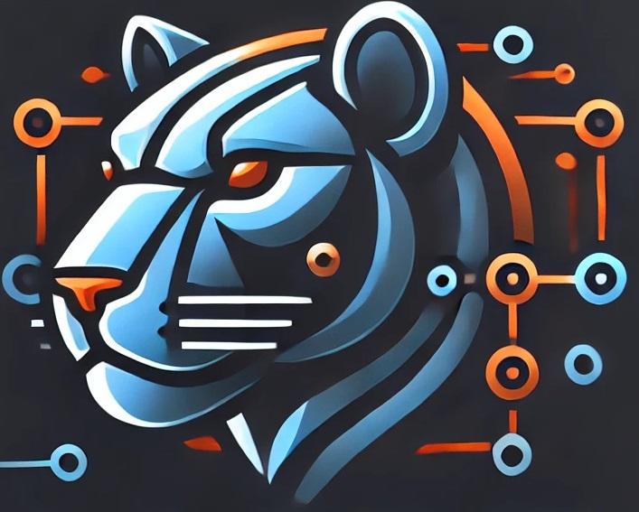

# LIGER

- [[L]] **Lightweight** → Fast and efficient
- [[I]] **Integration** → Connect to many/multiple databases
- [[G]] **Grid-based** → Display data in grids, CRUDs and charts
- [[E]] **ETL-tools** → A powerful engine for ETL and data analysis
- [[R]] **Reversal-engine** → Database reverse engineering

| -------------------------------- | --------------------------------- |
|      |   |
|  |  |
|  |     |

Framework that will be written for 2 languages, Python and PHP
Reverse engineers various types of databases and easily displays grids, CRUD, graphs, reports, etc.

With authentication, webserver, logs, ETL tools and much more.

Agenda:

- Webserver
- Logs
- Sessões
- Monitor
- Crypt
- Config
- Collector (EtL)
- ORM (Doing)
- Engenharia Reversa
- Permitions
- Route
- DEF
  - Data Grid
  - Elements
  - Form

Objetivo: Ter uma linguagem declarativa para Telas em Web (Evitar Frontend ao máximo)
